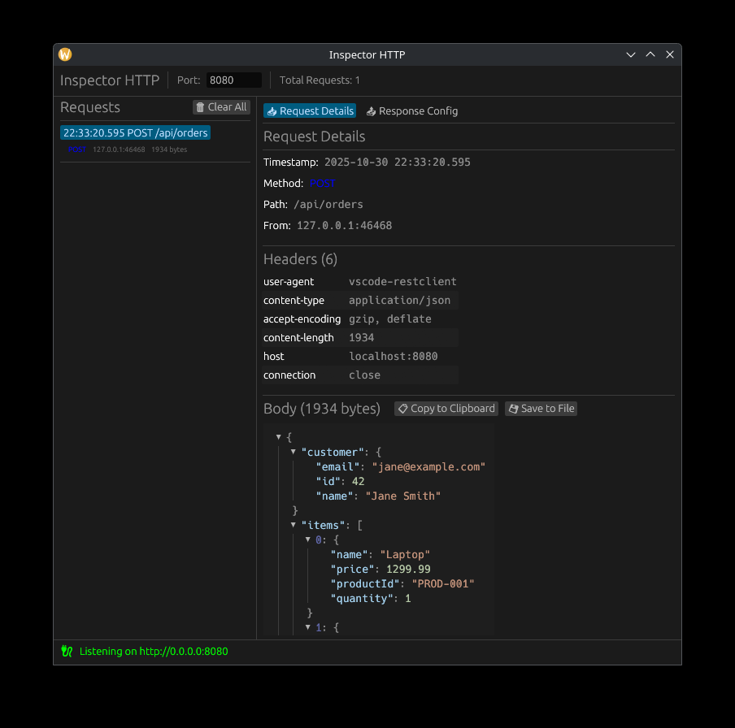

# Inspector HTTP


A desktop HTTP server with a GUI for monitoring and inspecting incoming requests. Perfect for development, testing webhooks, and debugging HTTP clients.




## Features

- **HTTP Server**: Configurable HTTP server with customizable responses
- **Response Configuration**: Customize HTTP status codes (200, 404, 500, etc.) and response bodies
  - Quick-select buttons for common status codes
  - Response body templates (JSON, HTML, plain text)
  - Real-time response customization without server restart
- **Real-time Monitoring**: View all incoming HTTP requests in a clean GUI
- **Request Details**: Inspect method, path, query parameters, headers, and body
- **JSON Visualization**: Interactive JSON tree view for JSON request bodies
- **Save & Export**: Copy request bodies to clipboard or save to files
- **Smart Filename Generation**: Automatically generates filenames based on Content-Type
- **Runtime Port Configuration**: Change the listening port without restarting
- **Auto Port Detection**: Automatically finds the first available port starting from 8080
- **Error Recovery**: Automatic rollback to last working port on binding errors
- **Tabbed Interface**: Switch between request details and response configuration

## Installation

### From crates.io

```bash
cargo install inspector-http
```

### From source

```bash
git clone https://github.com/tran-engineering/inspector-http.git
cd inspector-http
cargo build --release
```

## Usage

Simply run the application:

```bash
inspector-http
```

The application will:
1. Find the first available port starting from 8080
2. Start an HTTP server on that port
3. Open a GUI window displaying all incoming requests

### GUI Features

- **Left Panel**: Overview list of all captured requests
- **Right Panel**: Tabbed interface with two views:
  - **Request Details Tab**: Detailed view of the selected request with JSON tree visualization
  - **Response Config Tab**: Configure HTTP status codes and response bodies
- **Top Panel**: Port configuration (can be changed at runtime)
- **Bottom Status Bar**: Current server status and temporary error messages

### Response Configuration

The Response Config tab allows you to customize how the server responds to incoming requests:

- **Status Codes**: Set any HTTP status code (100-599) with quick-select buttons for common codes
- **Response Body**: Customize the response body with a multiline editor
- **Templates**: Quick templates for common response types (JSON success/error, HTML, plain text)
- **Real-time Updates**: Changes take effect immediately for new requests

### Testing

A `sample.http` file is included with example requests. You can use it with the REST Client extension in VS Code or similar tools.

## Development

### Requirements

- Rust 1.70+
- GTK3 (Linux only)
- System dependencies for egui (platform-specific)

### Building

```bash
cargo build
```

### Running

```bash
cargo run
```

## Technologies

- **[eframe](https://github.com/emilk/egui)**: GUI framework (EGUI)
- **[hyper](https://hyper.rs/)**: HTTP server
- **[tokio](https://tokio.rs/)**: Async runtime
- **[egui_json_tree](https://github.com/dmackdev/egui_json_tree)**: JSON visualization
- **[rfd](https://github.com/PolyMeilex/rfd)**: Native file dialogs

## License

Licensed under either of:

- Apache License, Version 2.0 ([LICENSE-APACHE](LICENSE-APACHE) or http://www.apache.org/licenses/LICENSE-2.0)
- MIT license ([LICENSE-MIT](LICENSE-MIT) or http://opensource.org/licenses/MIT)

at your option.

## Contributing

Contributions are welcome! Please feel free to submit a Pull Request.
